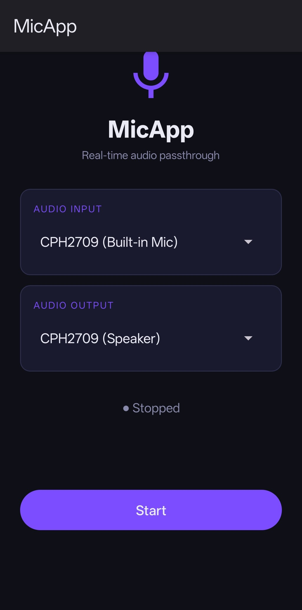

# MicApp

A simple Android app that captures real-time audio from a microphone input and replays it through a selected output device (Bluetooth speaker, wired headphones, built-in speaker, etc.).

The initial version of this app was developed in under an hour using Github Copilot with Claude Sonnet 4.6. The prompt for the planning session can be found in
[Project Specification](./Project-Specification.md) file.



## Features

- Select any available audio input (built-in mic, USB mic, headset, etc.)
- Select any available audio output (Bluetooth A2DP/BLE, wired headphones, speaker, etc.)
- Device list updates automatically when a Bluetooth device connects or disconnects
- Single toggle button to start / stop passthrough
- Use Android's built-in `AcousticEchoCanceler` to pervent feedback loops

## Requirements

- Docker (no other tools need to be installed on the host)

## Build

```bash
# 1. Build the Docker image (once, or after Dockerfile changes)
make image

# 2. Bootstrap the Gradle wrapper (once per fresh checkout)
make init

# 3. Build the debug APK
make build

# 4. Copy the APK to ./output/
make apk
```

The APK is produced at `output/mic-app.apk`.

## Install

Transfer `output/mic-app.apk` to your Android device and open it with a file manager. Enable **"Install unknown apps"** for your file manager when prompted, then tap **Install**.

Alternatively, with ADB:

```bash
adb install output/mic-app.apk
```

## Permissions

The app requests the following permissions on first launch:

- **Microphone** — to capture audio input
- **Bluetooth Connect / Scan** — to discover and route audio to Bluetooth devices
- **Modify Audio Settings** — granted automatically at install
